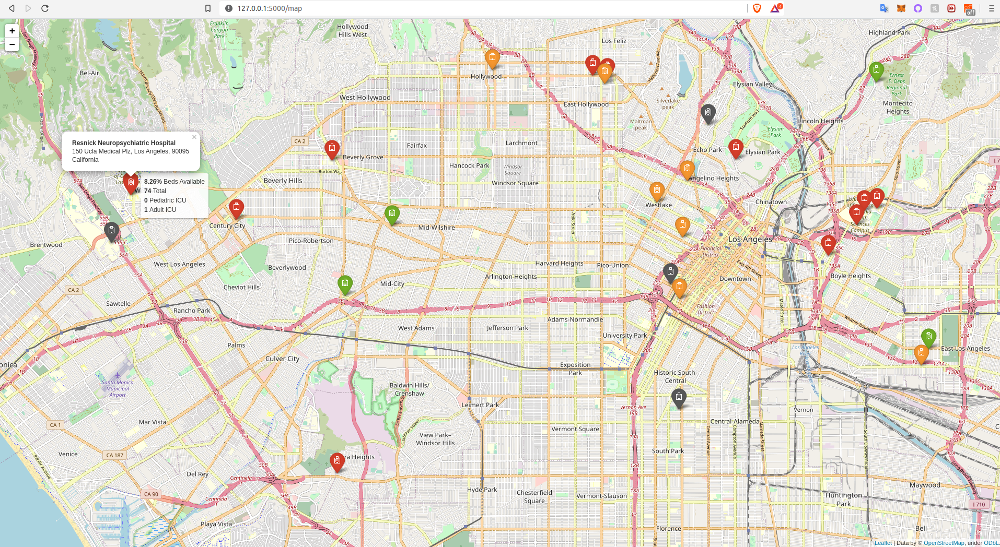
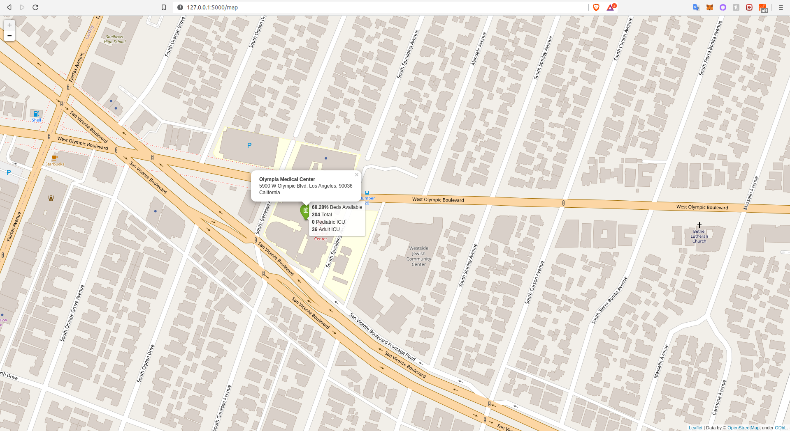

# hospital-beds
USA hospital beds capacity web app

## Inspiration
The COVID-19 lock down has us thinking twice before going out and thinking more than a couple times before going to a hospital if not in an emergency. Being at a hospital in these times can expose you to COVID-19 and other dangers just by being there. This tool can be used to get a glimpse of information about surrounding hospitals to help make a decision on which one to go if neccesary depending on how busy the hospital beds are.

## What it does
This web app lets you search in a **US** city or state and renders a map of hospitals in the selected area.

Hospital icons are displayed in the following way:
- Green: 2/3 or more beds available
- Green: Above 1/3 beds available
- Red: Below 1/3 beds available
- Gray: If no bed data is available in the dataset

On mouseover, the app displays the percentage of available beds on mouseover, the total number of staffed beds and pediatric and  adult ICU beds.

## How I built it
### Data description
The dataset is from the [AWS Data Exchange](https://console.aws.amazon.com/dataexchange/home?region=us-east-1#/products) and it's called [USA Hospital Beds | Definitive Healthcare](https://aws.amazon.com/marketplace/pp/prodview-yivxd2owkloha?ref_=srh_res_product_title). Up next is the description given by the data developer:
- Definitive Healthcare provides intelligence on the numbers of licensed beds, staffed beds, ICU beds, and the bed utilization rate for the hospitals in the United States.

### Web App
Using [Flask](https://flask.palletsprojects.com/en/1.1.x/) for [Python](https://www.python.org/) I wrote a barebones web app that would take in a search inquiry from the user and render another page from there. Then, I used [folium](https://python-visualization.github.io/folium/) to generate maps using the search inquiry. The search inquiry is processed with [Pandas](https://pandas.pydata.org/) since the app looks for the inquiry within a Comma Separated Values (*.csv) [dataset](https://aws.amazon.com/marketplace/pp/prodview-yivxd2owkloha?ref_=srh_res_product_title).

## Challenges I ran into
The folium documentation is challenging since it's hard to search in and there are not many examples of fully-fleshed out applications using the framework. Another challenge was using Flask since I had only used it for a brief project before. Most people face the challenge of hosting with AWS, which can be very complicated for someone who has never used AWS before. I have completed some AWS training but never hosted a web app before.

## Accomplishments that I'm proud of
Learning how to use two frameworks (Flask and Folium) in a few weeks and being able to integrate them using Object Oriented Programming (OOP) was challenging and rewarding.

## What I learned
System integration, Web development, AWS Cloud Services, Flask, OOP, folium

## What's next for Hospital beds finder
Integrate more functionality such as:
- Machine learning
- Implement the use of geopandas to be able to exploit the geojson dataset version of the data
- Integrate multiple data sources to make the app not limited to the US
- Implement "find near me" functionality

## Installation
### using a conda virtual environment (optional but recommended)
Naming the environment "geojson"

`conda create -n geojson python=3.7`

`conda activate geojson`

`conda install jupyter notebook` (Optional)

### Installing dependencies
`pip install -r requirements.txt`

#### AWS EB requirements
The following need to be in your requirements file in order for AWS Elastic Beanstalk to serve your app:
- click==6.7
- Flask==1.0.2
- itsdangerous==0.24
- Jinja2==2.10
- MarkupSafe==1.1.1 (1.0 can cause errors)
- Werkzeug==0.14.1

### Implementing "find near me" (Optional)
You may do so using curl
### Verify curl is installed
`curl --version`

### If not, install curl (Optional but recommended)
`sudo apt update`

`sudo apt upgrade`

`sudo apt install curl`
