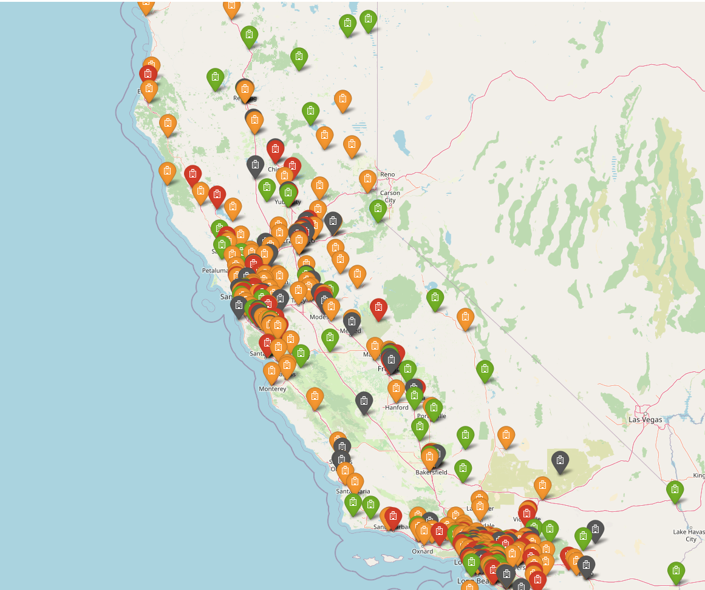
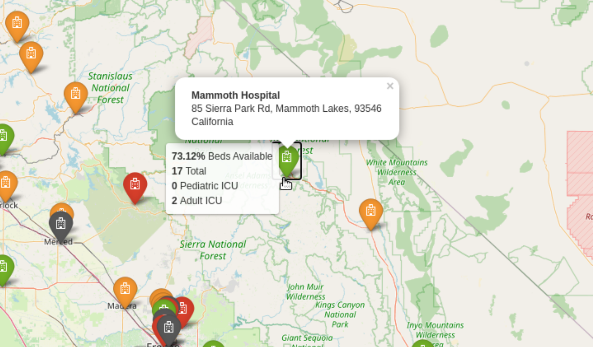

# hospital-beds
USA hospital beds capacity web app. Originally developed on AWS but moved to Heroku. Try it at https://hospital-beds.herokuapp.com/

## Inspiration
The COVID-19 lock down has us thinking twice before going out and thinking more than a couple times before going to a hospital if not in an emergency. Being at a hospital in these times can expose you to COVID-19 and other dangers just by being there. This tool can be used to get a glimpse of information about surrounding hospitals to help make a decision on which one to go if necessary depending on how busy the **hospital beds** are.

## What it does
This web app lets you search in a **US** zip code, city or state and renders a map of hospitals in the selected area.

Hospital icons are displayed in the following way:
- Green: 2/3 or more beds available
- Orange: Above 1/3 beds available
- Red: Below 1/3 beds available
- Gray: If no bed data is available in the dataset

On mouseover, the app displays the percentage of available beds on mouseover, the total number of staffed beds and pediatric and adult ICU beds. On click, the app displays the hospital name and its address.

## How I built it
### Data description
The dataset is from the [AWS Data Exchange](https://console.aws.amazon.com/dataexchange/home?region=us-east-1#/products) and it's called [USA Hospital Beds | Definitive Healthcare](https://aws.amazon.com/marketplace/pp/prodview-yivxd2owkloha?ref_=srh_res_product_title). Up next is the description given by the data developer:
- Definitive Healthcare provides intelligence on the numbers of licensed beds, staffed beds, ICU beds, and the bed utilization rate for the hospitals in the United States.

### Web App
Using [Flask](https://flask.palletsprojects.com/en/1.1.x/) for [Python](https://www.python.org/) I wrote a web app form that would take in a search inquiry from the user and render another page from there. Then, I used [folium](https://python-visualization.github.io/folium/) to generate maps using the search inquiry. The search inquiry is processed with [Pandas](https://pandas.pydata.org/) since the app looks for the inquiry within a Comma Separated Values (*.csv) [dataset](https://aws.amazon.com/marketplace/pp/prodview-yivxd2owkloha?ref_=srh_res_product_title).

### AWS Resources used

- [Identity Access Management (IAM)](https://aws.amazon.com/iam/) role with permissions to write to S3 and to instantiate an EC2 machine

- [Amazon S3 AKA Amazon Simple Storage Service](https://aws.amazon.com/s3/) holding the dataset obtained through [AWS Data Exchange](https://console.aws.amazon.com/dataexchange/home?region=us-east-1#/products)

- A public [Amazon S3 AKA Amazon Simple Storage Service](https://aws.amazon.com/s3/) containing the application

- [Amazon Elastic Compute Cloud (Amazon EC2)](https://aws.amazon.com/ec2/) for a virtual Linux 2 t2.micro machine instance running the application on the cloud

- [Elastic Beanstalk](https://aws.amazon.com/elasticbeanstalk/) For deployment of web application and load balancing

- [Amazon Route 53](https://aws.amazon.com/route53/) to register a unique Domain Name System (DNS)

- [Amazon Elastic Load Balancer](https://aws.amazon.com/elasticloadbalancing/) To distribute Elastic Beanstalk application traffic

- [AWS Certificate Manager](https://console.aws.amazon.com/acm/home?region=us-east-1#/) To get a Secure Sockets Layer (SSL) certificate for a domain/web application

- [AWS Data Exchange](https://console.aws.amazon.com/dataexchange/home?region=us-east-1#/products) [USA Hospital Beds | Definitive Healthcare](https://aws.amazon.com/marketplace/pp/prodview-yivxd2owkloha?ref_=srh_res_product_title) dataset

## Challenges I ran into
The folium documentation is challenging since it's hard to search in and there are not many examples of fully-fleshed out applications using the framework. Another challenge was using Flask since I had only used it for a brief project before. Most people face the challenge of hosting with AWS, which can be very complicated for someone who has never used AWS before. I have completed some AWS training but never hosted a web app before so I went through the documentation, looked for examples and even contacted AWS help because of a feature I am waiting to hear back so I can implement.

## Accomplishments that I'm proud of
Learning how to use two frameworks (Flask and Folium) in a few weeks and being able to integrate them using Object Oriented Programming (OOP) was challenging and rewarding. Being able to deploy to AWS with a custom domain name was very rewarding as well.

## What I learned
Web development, AWS Data Exchange, AWS Cloud Services, Flask, OOP, folium, geospatial analysis, Full Stack development, bootstrap, javascript, app forms

## What's next for Hospital beds finder
- Implement the use of geopandas to be able to exploit the geojson dataset version of the data
- Dailyt bed capacity predictions using machine learning
- Integrate multiple data sources to make the app not limited to the US
- Implement "find near me" functionality
- Add AWS Cloudfront event that triggers AWS Lambda to refresh the dataset S3 with every new revisions by the provider (waiting to hear back from AWS help)

## Installation
### using a conda virtual environment (optional but recommended)
Naming the environment "geojson"

`conda create -n flask python==3.7.6`

`conda activate flask`

`conda install jupyter notebook==5.7.8 tornado==4.5.3` (Optional)

### Installing dependencies
`pip install -r requirements.txt`

## Running the application locally

Make sure your virtual environment is active and then run the following command on your on your command line:

`python application.py`

Open a browser and go to the localhost indicated by your command line (e.g. http://127.0.0.1:5000/, it can vary)

#### AWS EB requirements
The following need to be in your requirements file in order for AWS Elastic Beanstalk to serve your app:
- click==6.7
- Flask==1.0.2
- itsdangerous==0.24
- Jinja2==2.10
- MarkupSafe==1.1.1 (1.0 can cause errors)
- Werkzeug==0.14.1

#### Heroku requirements
- gunicorn
- Profile pointing to application file using :app tag
